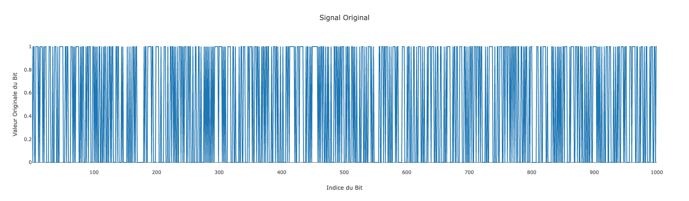
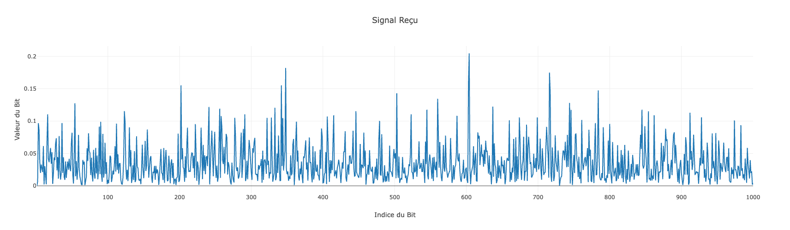
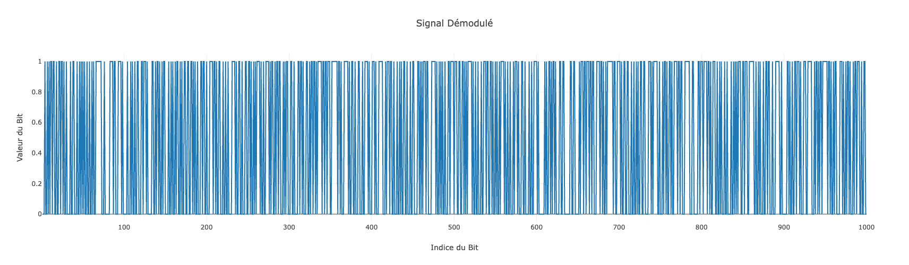

# yassinouk.github.io
# Readme
 <!-- hero image -->

## Encadré par
Fouad AYTOUNA

## Réalisé par
Yassin OUAKKA

## Description
Ce code implémente une simulation basique d'un canal LTE (Long-Term Evolution) en utilisant le langage de programmation Go. Le canal LTE est modélisé avec des fonctionnalités telles que la modulation/démodulation BPSK, la modulation OFDM (Orthogonal Frequency-Division Multiplexing), l'effet de diffusion de Rayleigh, et l'ajout de bruit blanc additif gaussien (AWGN). Le résultat de la simulation est affiché, et un serveur web est également lancé pour fournir des données en réponse à des requêtes HTTP.

## Fonctionnalités principales
- **Modulation BPSK**: Les bits générés sont modulés en symboles complexes bpsk.
- **Modulation OFDM**: Les symboles modulés sont soumis à une modulation OFDM à l'aide de la transformée de Fourier rapide (FFT/IFFT).
- **Effet de diffusion de Rayleigh**: Modélisation de l'effet de la diffusion de Rayleigh sur les symboles transmis.
- **Bruit blanc additif gaussien (AWGN)**: Ajout d'un niveau de bruit gaussien aux symboles transmis pour simuler des conditions réelles.

## Utilisation
Pour exécuter la simulation et le serveur web, assurez-vous d'avoir Go installé sur votre machine. Exécutez ensuite le fichier principal `go run main.go`. Le serveur web sera disponible à l'adresse [http://localhost:8080](http://localhost:8080).
ou bien cliquer sur le fichier executable avec index.html dans le meme dossier, le serveur web sera disponible à l'adresse [http://localhost:8080](http://localhost:8080).
Le serveur web expose trois endpoints API pour obtenir des données sous forme de réponses JSON :
- `/api/endpoint1`: Les bits démodulés après la simulation.
- `/api/endpoint2`: Les symboles transmis modélisés comme des entiers après l'effet de diffusion de Rayleigh.
- `/api/endpoint3`: Les bits d'origine générés pour la simulation.

## Exemple d'exécution
1. Générer 100 bits aléatoires.
2. Moduler les bits en symboles complexes.
3. Appliquer la modulation OFDM.
4. Modéliser l'effet de diffusion de Rayleigh.
5. Ajouter du bruit blanc additif gaussien (AWGN).
6. Démoduler les symboles transmis.
7. Comparer les bits d'origine et les bits démodulés.
8. Le ratio de correspondance des bits est affiché à la fin de l'exécution.

## Dépendances tierces
Ce projet utilise le package tiers `github.com/mjibson/go-dsp/fft` pour les transformations FFT/IFFT.

## Documentation
Le code source fourni met en œuvre les fonctions primaires pour simuler la transmission de signaux sur un canal de Long Term Evolution (LTE). Il comporte la modulation Binary Phase Shift Keying (BPSK) et le multiplexage par répartition orthogonale de la fréquence (OFDM) pour transmettre les signaux sur le canal LTE. Il simule les effets typiques qui affectent la transmission du signal sur un canal LTE et comprend des fonctions pour gérer le bruit du signal et les effets de dégradation.

Les sections suivantes documentent les fonctions `OFDMModulate`, `OFDMDemodulate`, `Demodulate`, `Transmit` et la manière dont les signaux de sortie sont traités.


### Signale original:
```go
func main() { // fonction principale
	lteChannel := &LTEChannel{} // crée un nouveau canal LTE
	bits := make([]int64, 1000) // génère un tableau de 100 bits
	for i := range bits {       // pour chaque bit
		bits[i] = int64(rand.Intn(2)) // génère un bit aléatoire (0 ou 1)
	}
```

 <!-- signal original image -->

### Modulation bpsk:
```go
func (c *LTEChannel) Modulate(bits []int64) []complex128 { // fonction pour moduler les bits dans les symboles complexes. Chaque bit est converti en symbole complexe
	symbols := make([]complex128, len(bits)) // création d'un tableau pour stocker les symboles

	for i, b := range bits { // iterate over each bit
		symbols[i] = complex(float64(2*b-1), 0) // convert the bit to a complex symbol
	}

	return symbols // retourne les symboles après la modulation
}
```

### Modulation OFDM:
```go
func (c *LTEChannel) OFDMModulate(symbols []complex128) []complex128 { // Fonction pour effectuer la modulation OFDM sur les symboles
	return fft.IFFT(symbols) // Utilise la transformée de Fourier rapide inverse (IFFT) pour obtenir les symboles modulés en OFDM.
}
```

### Rayleigh channel:
```go
func (c *LTEChannel) Rayleigh(symbols []complex128) []complex128 { // fonction pour modéliser l'effet de la diffusion de Rayleigh sur les symboles
	for i := range symbols { // pour chaque symbole
		gain := complex(rand.NormFloat64(), rand.NormFloat64()) // génération d'un gain complexe aléatoire suivant une distribution normale
		symbols[i] = symbols[i] * gain                          // multiplication du symbole par le gain pour modéliser l'effet de la diffusion de Rayleigh
	}
	fmt.Println("symbols output from rayleigh channel\n", symbols)

	return symbols // retourne les symboles après l'effet de la diffusion de Rayleigh
}
```
### output:
```console
symbols output from rayleigh channel
 [(0.028590689424965985-0.025046291032610545i) (-0.051519739879452985-0.017037712151984925i) (-0.004556136507801563-0.019192001072470176i) (0.014619318304108715-0.012981220336202255i)...]
```

### AWGN bruit:
```go
func (c *LTEChannel) AWGN(symbols []complex128, snr float64) []complex128 { // fonction pour ajouter un bruit blanc additif gaussien (AWGN) aux symboles
	power := math.Pow(10, (noiseFloor-snr)/10)           // calcule la puissance du bruit
	symbolsPlusNoise := make([]complex128, len(symbols)) // créer un tableau pour stocker les symboles plus le bruit

	for i := range symbols { // pour chaque symbole
		noise := complex(rand.Float64()*power, 0) // générer un bruit complexe aléatoire proportionnel à la puissance du bruit
		symbolsPlusNoise[i] = symbols[i] + noise  // ajout du bruit au symbole
	}

	return symbolsPlusNoise // retourne les symboles après ajout du bruit AWGN
}
```

### Transmission:
```go
func (c *LTEChannel) Transmit(bits []int64, snr float64) []complex128 { // Fonction pour transmettre des bits sur le canal LTE
	symbols := c.Modulate(bits)       // Modulation des bits en symboles
	symbols = c.OFDMModulate(symbols) // Modulation OFDM des symboles
	symbols = c.Rayleigh(symbols)     // Ajout de l'effet de la diffusion de Rayleigh aux symboles
	return c.AWGN(symbols, snr)       // Ajoute le bruit AWGN aux symboles et retourne les symboles transmis
}
```
### output:
```console
transmitted
 [(0.02859068953131702-0.025046291032610545i) (-0.05151973982790638-0.017037712151984925i) (-0.004556136500509521-0.019192001072470176i)...]
```
La fonction `Transmit` intègre toutes les effets de modulation et de transmission (Rayleigh & AWGN) en un seul processus qui simule la transmission de bits sur un canal LTE. Le résultat de cette fonction est les symboles complexes qui représentent le signal transmis.
 <!-- signal recu image -->

### Démodulation OFDM:
```go
func (c *LTEChannel) OFDMDemodulate(symbols []complex128) []complex128 { // Fonction pour effectuer la démodulation OFDM sur les symboles
	return fft.FFT(symbols) // Utilise la transformation de Fourier rapide (FFT) pour obtenir les symboles démodulés en OFDM.
}
```
### output:
```console
ofdm demodulation:
 [(-1.5515888104296438+1.4467145164462023i) (1.429307721774392-0.3449814028136927i) (-1.59164715622883+0.4571744410232078i) (-1.180802240752774-0.6198685139043072i)...]
```

### Démodulation bpsk:
```go
func (c *LTEChannel) Demodulate(symbols []complex128) []int64 { // Fonction pour démoduler les symboles en bits
	bits := make([]int64, len(symbols)) // Crée un tableau pour stocker les bits

	for i, s := range symbols { // Pour chaque symbole
		if real(s) >= 0 { // si la partie réelle du symbole est supérieure ou égale à zéro
			bits[i] = 1 // le bit est 1
		} else { // sinon
			bits[i] = 0 // le bit est 0
		}
	}

	return bits // Retourne les bits après la démodulation
}
```
 <!-- hero image -->

## Auteur
OUAKKA Yassin

## Licence
Ce projet est sous licence MIT.
